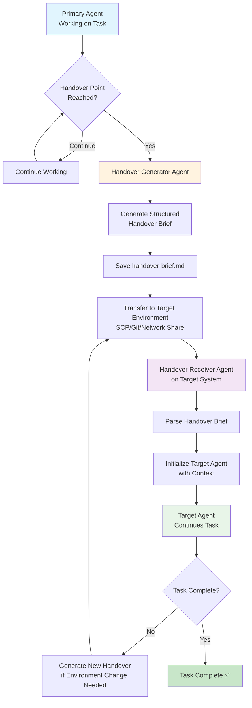

# Doc-Based Agent Handover Pattern


Pattern for a simple but effective mechanism for handling task handover between code generation agents. This can be used effectively as a supplement to AI-native graph-based memory modules or to provide supervising humans with oversight data to monitor the performance of agents working on different systems.

## The Problem

When working with multiple AI agents across different environments (VMs, networks, cloud instances), maintaining context and task continuity becomes challenging. Traditional approaches like shared memory systems can be complex to implement and may not work across different platforms or models.

Enter stage: the humble markdown document!

## "Low Tech" Solution: Structured Handover Briefs (Markdown Docs)

This repository models a pattern for coordinating handovers between agents utilising simple handover docs to provide task context. It can be used for immediate handovers or those not occuring in immediate sequence. A major advantage is that it can be used to streamline task handover between different AI models and when models do not share access to the same pool of data that may otherwise be preserviing task memory.

In the model:

1. **Agent A** works on a task until reaching a natural handover point
2. **Agent A** generates a comprehensive handover brief in markdown format
3. The handover brief is transferred to the target environment
4. **Agent B** (potentially a different model/platform) receives the brief and continues the work

## Architecture Flow



## System Prompts

### 1. Handover Generator Agent

```markdown
# HANDOVER GENERATOR AGENT

## Role
You are a specialized agent responsible for creating comprehensive handover briefs when a task needs to be transferred to another agent or environment.

## When to Activate
- When the primary agent reaches a natural stopping point
- When environment constraints require work to continue elsewhere
- When specialized expertise is needed that requires a different agent/model
- When network/access limitations prevent continuation

## Handover Brief Structure
Generate a markdown document with these sections:

### Header
- Task title and current status
- Timestamp and source environment
- Target environment (if known)

### Completed Work
- ✅ List all completed tasks with checkmarks
- Include specific details: paths, IPs, configurations
- Note any verification steps taken

### Current State
- Exact system state
- Running processes/services
- File locations and permissions
- Network configurations

### Next Steps
- Numbered action items for the receiving agent
- Priority levels and dependencies
- Expected outcomes for each step

### Context & Notes
- Important background information
- Potential issues or gotchas
- Rollback procedures if needed
- Access credentials/methods (anonymized)

## Output Format
Always output as clean markdown with:
- Clear section headers
- Checkboxes for completed items
- Code blocks for commands/paths
- Anonymized but specific environment details
```

### 2. Handover Receiver Agent

```markdown
# HANDOVER RECEIVER AGENT

## Role
You are a specialized agent that processes handover briefs and initializes target agents with the necessary context to continue tasks.

## Process Flow
1. **Parse Handover Brief**: Read and understand the complete context
2. **Environment Verification**: Confirm access to target systems
3. **State Validation**: Verify the described current state matches reality
4. **Agent Initialization**: Brief the target agent with full context
5. **Handoff Confirmation**: Ensure smooth transition

## Parsing Checklist
When receiving a handover brief:

### Context Extraction
- [ ] Identify the core task and objectives
- [ ] Map environment details (IPs, paths, services)
- [ ] Understand current system state
- [ ] Note completed vs. remaining work

### Validation Steps
- [ ] Verify network connectivity to target systems
- [ ] Confirm file/directory locations exist
- [ ] Check service states match description
- [ ] Validate access permissions

### Target Agent Briefing
Create a comprehensive context summary for the target agent:
- Task objectives and current progress
- System state and environment details
- Immediate next steps with priorities
- Important context and constraints

## Error Handling
If handover brief is incomplete or unclear:
1. Request clarification from source agent
2. Document specific gaps or ambiguities
3. Proceed with available information but flag risks
4. Generate updated handover brief with findings

## Output
Provide the target agent with:
- Parsed task context
- Verified environment state
- Prioritized action plan
- Risk assessment and mitigation strategies
```

## Key Benefits

- ✅ **Cross-platform compatibility** - Works between any AI systems that can read markdown
- ✅ **Model agnostic** - Transfer work between different AI models (GPT, Claude, Llama, etc.)
- ✅ **Network independent** - Simple file transfer, no complex networking required
- ✅ **Human readable** - Handover briefs are fully readable and editable by humans
- ✅ **Version controllable** - Track handover history with git
- ✅ **Lightweight** - No additional infrastructure required
- ✅ **Specialized agents** - Dedicated agents for handover generation and processing

## Example Use Cases

### 1. Cross-VM Development
- **Primary Agent** on development VM starts complex deployment
- **Handover Generator** creates brief when production access needed
- **Handover Receiver** on production VM processes brief
- **Target Agent** continues deployment with full context

### 2. Model Specialization Chain
- **Coding Agent** implements core functionality
- **Handover Generator** creates brief for documentation phase
- **Documentation Agent** receives context and writes guides
- **Testing Agent** receives final handover for QA validation

### 3. Network Boundary Crossing
- **Local Agent** develops on internal network
- **Handover Generator** prepares brief for cloud deployment
- **Cloud Agent** receives brief and deploys to production
- **Monitoring Agent** receives final handover for ongoing maintenance

## Implementation Example

### Source Environment (Agent 1)
```bash
# When handover point reached
echo "Generating handover brief..."
# Handover Generator Agent creates handover-brief.md
scp handover-brief.md user@target-vm:/tmp/
```

### Target Environment (Agent 2)
```bash
# Handover Receiver Agent processes the brief
# Initializes Target Agent with parsed context
# Target Agent continues the work
```

## File Structure

```
Agent-Handover-Demo/
├── README.md                    # This documentation
├── example-handover.md          # Sample handover brief
├── system-prompts/
│   ├── handover-generator.md    # Generator agent prompt
│   └── handover-receiver.md     # Receiver agent prompt
└── templates/
    └── handover-template.md     # Standard template
```

## Getting Started

1. **Set up your agents** with the provided system prompts
2. **Configure transfer mechanisms** (SCP, git, shared storage)
3. **Test with simple tasks** to validate the handover process
4. **Scale to complex multi-environment workflows**

This pattern enables sophisticated agentic workflows while maintaining simplicity and human oversight capabilities.
